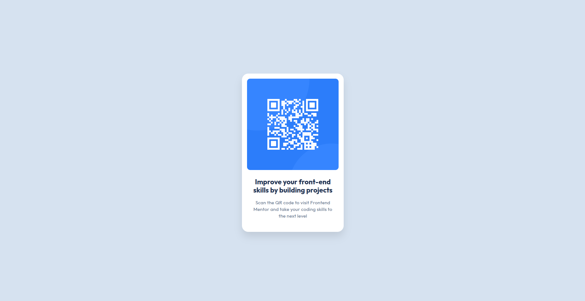

# Frontend Mentor - QR Code Component Solution

This repository contains my solution to the **QR Code Component** challenge from Frontend Mentor. The goal of this challenge was to recreate a simple, responsive QR code card using semantic HTML and modern CSS while closely matching the provided design.

## 📑 Table of Contents

- [Overview](#-overview)
  - [Screenshot](#-screenshot)
  - [Links](#-links)
- [My Process](#-my-process)
  - [Built With](#-built-with)
  - [What I Learned](#-what-i-learned)
  - [Continued Development](#-continued-development)
- [Author](#-author)
- [Acknowledgments](#-acknowledgments)

---

## 📖 Overview

The QR Code Component is a beginner-friendly Frontend Mentor challenge focused on building a responsive card component while practicing clean HTML structure, CSS styling, spacing, typography, and layout techniques.

### 📸 Screenshot



> Replace `preview.png` with your project's screenshot.

### 🔗 Links

- **Solution URL:** https://www.frontendmentor.io/solutions/your-solution-link
- **Live Site:** https://your-live-site-url.com

---

## 🚀 My Process

### 🛠 Built With

- Semantic HTML5
- CSS3
- CSS Custom Properties (Variables)
- Flexbox
- Mobile-first workflow
- Responsive Design
- Google Fonts (Outfit)

---

### 📚 What I Learned

Although this is a simple project, it helped reinforce several fundamental frontend concepts.

During this project I practiced:

- Structuring semantic HTML
- Creating reusable CSS variables
- Centering elements using Flexbox
- Applying responsive layouts
- Working with spacing, border-radius, and shadows
- Following a mobile-first approach

Example of using CSS variables:

```css
:root {
    /* colors */
  --white: hsl(0, 0%, 100%);
  --slate-300: hsl(212, 45%, 89%);
  --slate-500: hsl(216, 15%, 48%);
  --slate-900: hsl(218, 44%, 22%);
}
```

### 🎯 Continued Development

In upcoming Frontend Mentor challenges, I plan to focus on:

- Writing cleaner and more maintainable CSS
- Improving accessibility (ARIA, semantic markup)
- Mastering responsive layouts
- Learning CSS Grid in depth
- Building reusable UI components
- Following better project structure and naming conventions

---

## 👨‍💻 Author

- **Name:** Anuj Raj
- **GitHub:** https://github.com/codewithanuj0311
- **Frontend Mentor:** https://www.frontendmentor.io/profile/codewithanuj0311

---

## 🙏 Acknowledgments

A big thanks to **Frontend Mentor** for providing realistic frontend challenges that help developers improve their HTML, CSS, JavaScript, and responsive design skills through hands-on practice.

Special thanks to the developer community and educational resources that continue to inspire best practices and modern web development techniques.